# Odyssey Launcher

**A fully 3D game launcher for your emulators and PC games, inspired by the PlayStation 2's memory card browser.**

Every system and every game is a floating 3D model. Consoles sit on the systems screen and games come in their real boxes, cases and cabinets, wrapped in their own cover art. Pick a system, pick a game, and it launches in the emulator you've set up. When you quit the game you're back where you left off.

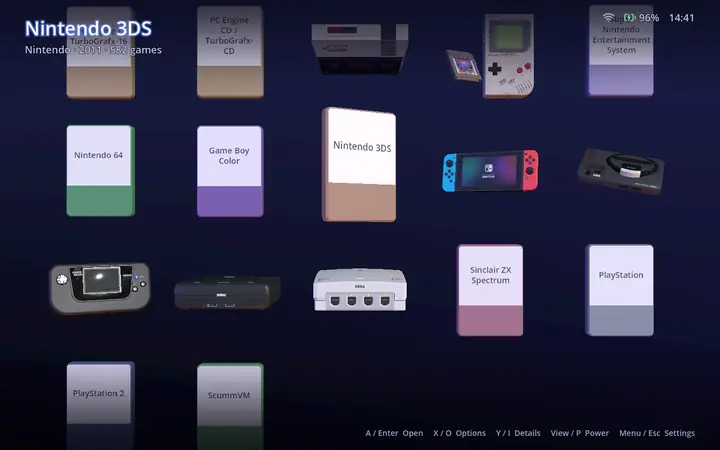

Odyssey Launcher is built with Godot 4 and C# for Windows, and is tuned on a Steam Deck running Windows. **Performance is the headline feature:** it starts fast, stays locked to your display's refresh rate while you scroll through thousands of games, and keeps its memory use low.

## Contents

- [Features](#features)
- [Screenshots](#screenshots)
- [Getting started](#getting-started)
- [Controls](#controls)
- [Configuration](#configuration)
- [Themes and models](#themes-and-models)
- [Credits](#credits)

## Features

### A 3D library

- **Systems, then games, then play.** The main screen is a 3D grid of your systems; enter one for a grid of its games. Moving between them flies the grids in and out of depth over a background gradient, as on the PS2.
- **Real boxes for real games.** Each system's games use a model of their packaging: Mega Drive clamshells, landscape SNES and N64 boxes, Game Boy boxes, jewel cases for CD systems, DVD cases, UMD and Switch cases, and arcade cabinets with the marquee and screen filled in. The front, back, spine and label each take the matching scraped art, and boxes can take their shape from the art itself.
- **Animated items.** The focused item lifts and sways, and models can carry their own animations: the console theme's Mega Drive takes a cartridge when you focus it, and the Switch slides a Joy-Con up its rail.
- **Pick it up and turn it round.** Press R3 to bring the focused game up large in the middle of the screen. Turn it with the right stick to read the back of the box or look along its spine.
- **Several layouts.** Show systems and games as a grid (automatic size, or your own columns and rows), a carousel, one item at a time, or a list of titles beside the focused game's model. Each system can have its own layout.
- **Favourites and Recently played** appear as cards of their own at the start of the systems grid.

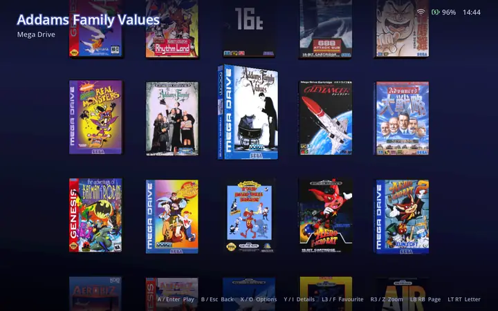

### Your collection, as it is

- **Over 160 systems built in.** These are ES-DE's catalogue, with the same folder names (`megadrive`, `snes`, `psx`, `ps2`...) and aliases (`genesis`, `sfc`...), plus Windows games, Steam games and desktop apps. Systems with no games stay hidden.
- **Multi-disc games** show as one game: an `.m3u`, `.cue` or `.gdi` hides the files it lists.
- **Clean titles** come from No-Intro and Redump file names. The region, languages, revision and disc number are kept as details, and titles sort naturally ("The Legend of Zelda" under L).
- **Sorting:** order systems by name, maker or release year. Order games by title, last played, time played, date added or release date, per system if you like.
- **Play history:** play counts, total play time and last played, recorded for every launch.
- **Import from ES-DE:** a system's `gamelist.xml` brings in its titles, metadata, favourites and media without overwriting anything you already have.
- **Network drives work well.** Folders are listed in large batches and scanned in parallel, and unplugging a drive never loses your favourites or history.

### Scraping

- **Four providers:** ScreenScraper, IGDB, SteamGridDB and the Steam store. Ask them in the order you choose; each later one fills only what the earlier ones didn't find.
- **ScreenScraper works out of the box** in releases. Add your own account in the settings for higher limits; IGDB and SteamGridDB need free keys of your own.
- **Every kind of media:** front and back covers, spines, screenshots, logos, fan art, disc and cartridge labels, videos and PDF manuals. You choose which kinds to download.
- **Accurate matching:** ScreenScraper identifies files by name, size and checksum, and a title search only counts a hit when the name really matches. When a match is wrong, "scrape this game" searches every provider at once, shows each result with its cover, and lets you choose.
- **Runs in the background** in a queue that survives closing the app, and respects each provider's rate limits and quotas.
- **Your own art and edits win.** Set any image yourself, edit a title or any metadata field, and a later scrape never overwrites it.
- **ES-DE's media layout:** media is stored in `covers/`, `screenshots/`, `videos/` and so on, under a folder you can move to any drive.

### Details and media

- **Game details (Y)** show everything the library knows: the description, release date, genre, developer, publisher, players, rating, region, play history and file.
- **Images and videos:** every scraped image appears as a card. Open one to view it full screen, or play the game's video with sound.
- **System details** show the console's model large, ready to turn, beside its history, emulators, folders and settings.

### Launching

- **Emulator profiles** drawn from ES-DE's list: RetroArch cores, standalone emulators (PCSX2, Dolphin, PPSSPP, DuckStation and more), and games that are their own program, script or shortcut.
- **Per-game overrides:** run one game with another emulator, from its options.
- **Steam games** are handed to Steam and followed until Steam says they've ended, so their play time is recorded too.
- **Clean hand-off:** while a game runs, the launcher stops drawing and frees its textures, so the emulator gets the machine. When the game ends, the launcher takes the foreground back so the controller works at once.

### Everything from the sofa

- **A full settings screen driven by the controller:** ROM folders, the media folder, emulators, themes, layouts, sorting, graphics, scraping providers, regions and credentials. It includes an on-screen keyboard, file and folder pickers, and a "test connection" button for each provider.
- **Options for each system and game (X):** the emulator, the 3D model, images, title and metadata, scraping, clearing metadata and deleting a game.
- **Power menu (View):** restart, shut down or sleep the PC, or quit the app.
- **Status indicators:** the clock, the battery, and the Wi-Fi signal or cable, top right, plus an optional FPS and video memory readout.
- **Graphics options:** borderless, exclusive fullscreen or windowed; 3D resolution; Direct3D 12 or Vulkan; anisotropic filtering.
- The mouse and keyboard work too.

### Built for speed

- It aims to be interactive within a second of its own start-up, even with a 10,000-game library. Nothing is scanned or decoded before the first frame.
- It aims to stay locked to the refresh rate while scrolling. The UI thread never touches the disk, the network or the database, and nothing allocates per frame.
- Covers stream in on background threads and are uploaded within a strict per-frame budget, so the visible grid is textured almost at once.
- Each kind of model is drawn in one batch, whatever the number of games.
- The baseline hardware is a Steam Deck, handheld at 1280×800 and docked to a 4K display.

## Screenshots

### Themes

The **Console** theme (the default) shows each system as its console. **Slab** shows each system as a dark slab with its logo. Switch themes from the settings or with <kbd>T</kbd>, without a restart.

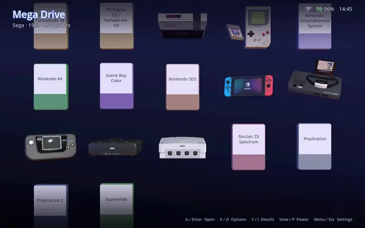

| Console | Slab |
|---|---|
| 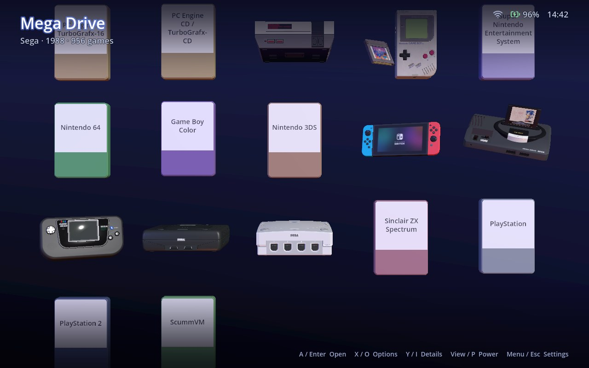 | 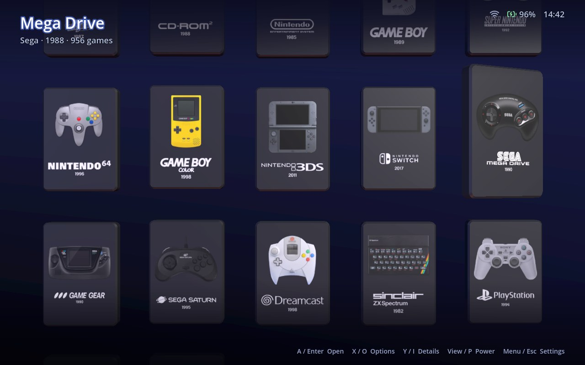 |

### Games

| Mega Drive | Super Nintendo |
|---|---|
| 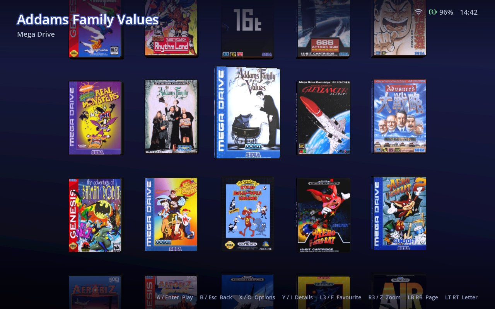 | 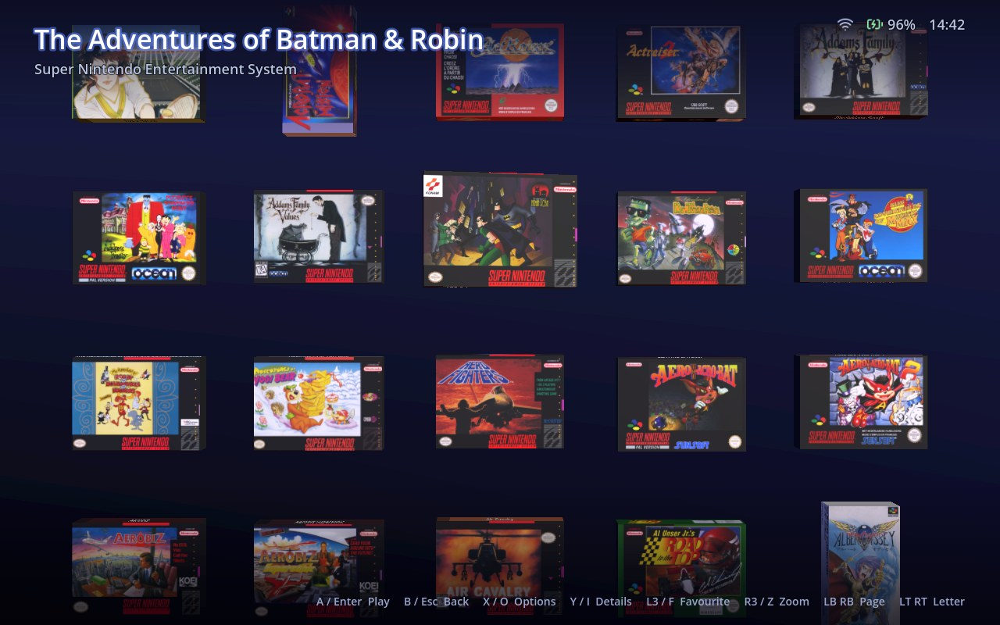 |
| **Arcade** | **Nintendo 64** |
| 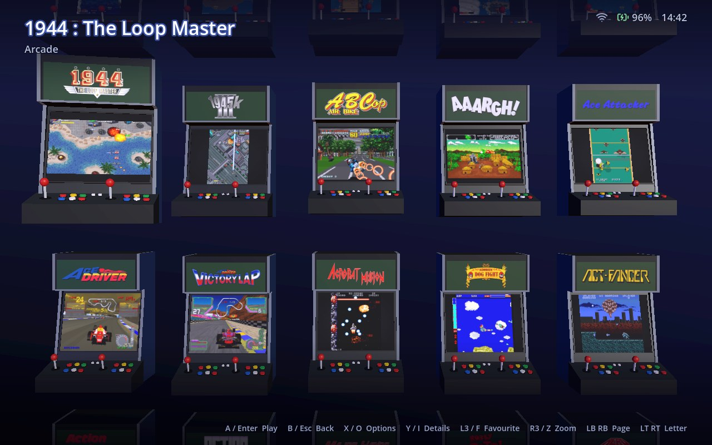 | 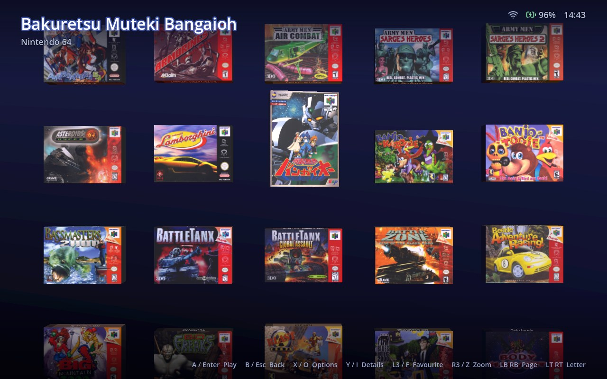 |

### Layouts

| Carousel | List |
|---|---|
| 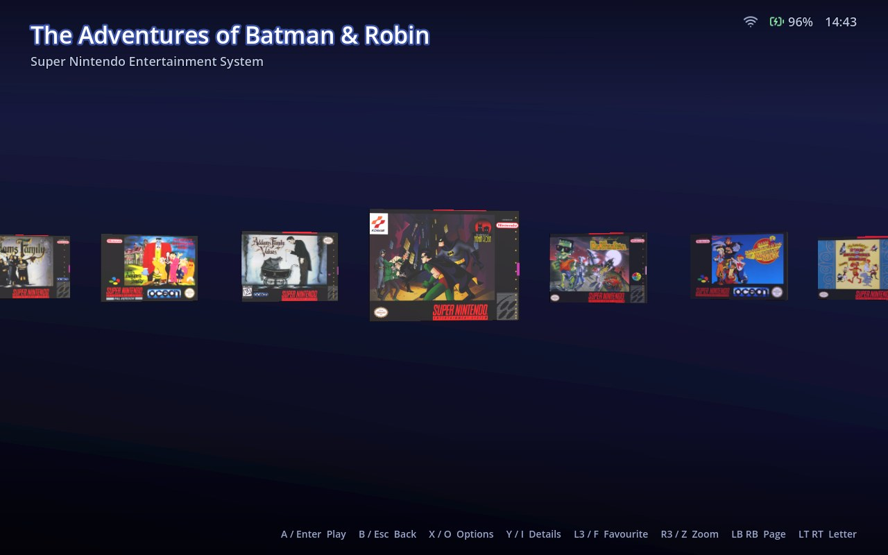 | 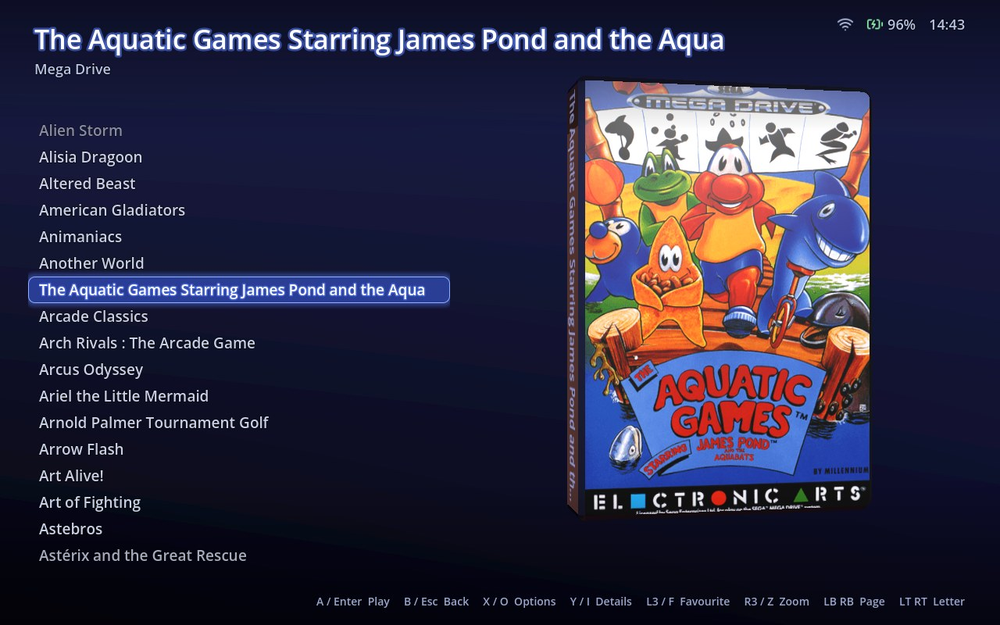 |

### Details and options

| Game details | System details |
|---|---|
| 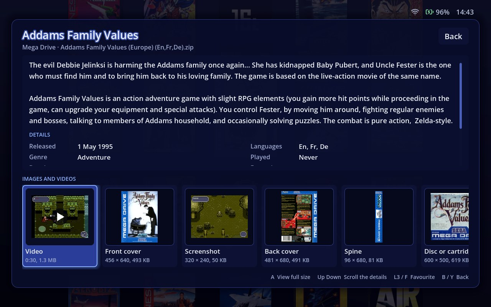 | 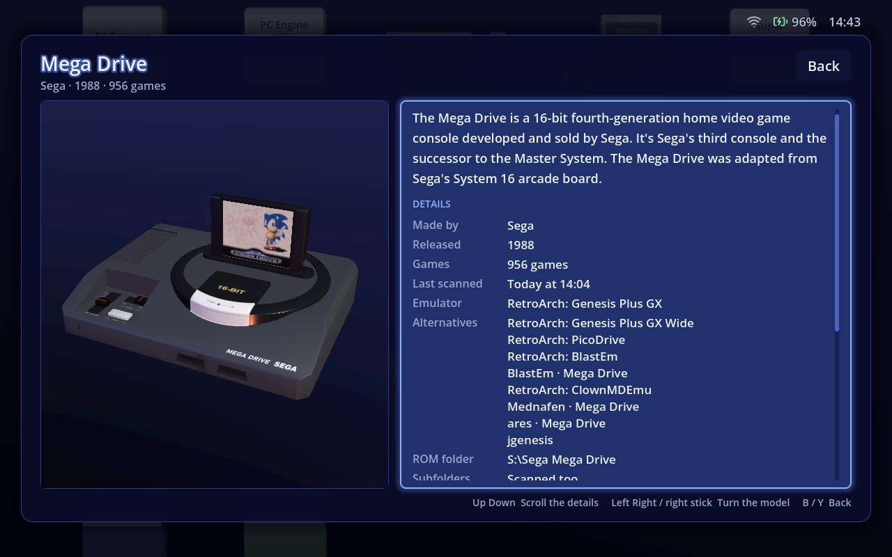 |
| **Game options** | |
| 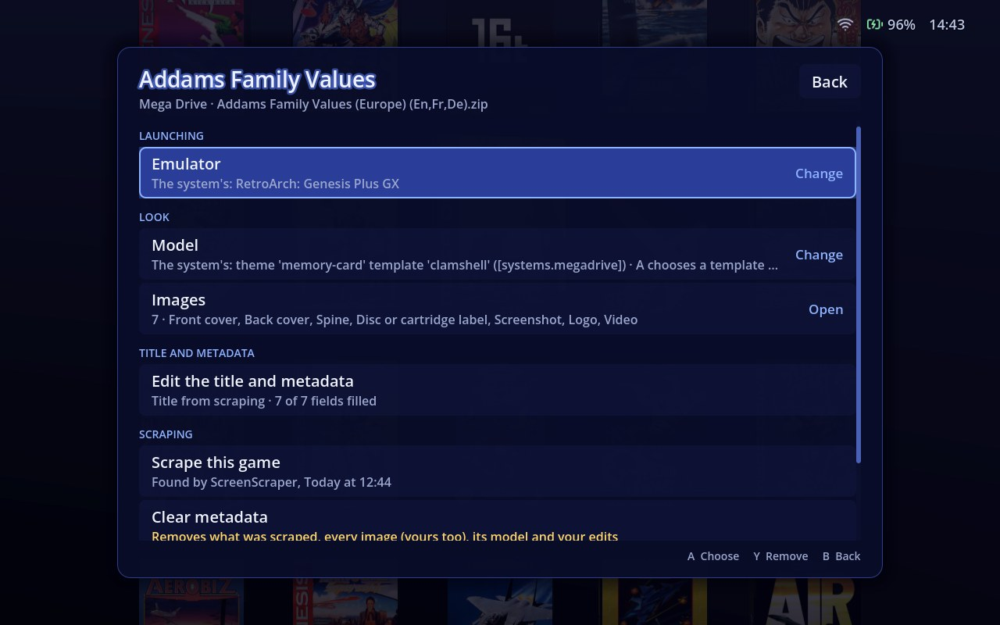 | |

## Getting started

1. **Download** the latest `OdysseyLauncher-<version>-windows-x86_64.zip` from [Releases](https://github.com/GeekRhapsody/OdysseyLauncher/releases), unzip it anywhere, and run `OdysseyLauncher.exe`. The .NET runtime is included, so there's nothing else to install. It needs 64-bit Windows 10 or 11 and a GPU with Direct3D 12 or Vulkan.
2. **Point it at your games.** By default each system's games are expected in `<your user folder>\ROMs\<system id>` (`ROMs\megadrive`, `ROMs\snes`...), as in ES-DE and RetroBat. In **Settings > ROM folders** you can set another root folder, or give any system its own folders.
3. **Point it at your emulators.** In **Settings > Emulators**, set the folder your emulators live in and RetroArch's folder. Each system's emulator can be changed from its options (X on its card). The settings list any emulator that's missing.
4. **Scrape** from **Settings**: "scrape all missing" fetches art and metadata for every game that lacks them. Add your ScreenScraper account (or IGDB and SteamGridDB keys) under **Scraping** for faster, fuller results.

**Portable mode:** put an empty `portable.txt` beside `OdysseyLauncher.exe`, and settings, databases, media and caches stay in a `userdata` folder next to it, instead of `%APPDATA%` and `%LOCALAPPDATA%`.

## Controls

| Action | Controller | Keyboard |
|---|---|---|
| Move | D-pad, left stick | Arrow keys |
| Open, play | A | Enter, Space |
| Back | B | Escape, Backspace |
| Options for the focused system or game | X | O |
| Details | Y | I |
| Favourite | L3 | F |
| Inspect (bring the game up close) | R3 | Z |
| Turn the focused item | Right stick | |
| Page up, page down | LB, RB | Page Up, Page Down |
| Previous, next letter | LT, RT | <kbd>[</kbd>, <kbd>]</kbd> |
| First, last | | Home, End |
| Settings | Menu | F1 (or Escape on the systems screen) |
| Power menu | View | P |
| Next theme | | T |
| Rescan the library | | F5 |

## Configuration

Everything in the settings screen is saved to plain TOML files in `%APPDATA%\OdysseyLauncher` (or `userdata\` in portable mode). You can edit them by hand too. They hold only what differs from the built-in defaults, and the app keeps your comments and formatting when it writes to them:

- `settings.toml`: folders, display, layouts, sorting and scraping.
- `systems.toml`: each system's ROM folders, file types, emulator and layout.
- `emulators.toml`: emulator profiles (program, core and arguments, with placeholders such as `{rom}` and `{core}`).
- `secrets.toml`: scraping credentials.

## Themes and models

Themes are folders of glTF 2.0 (`.glb`) models plus a `theme.toml`. The manifest sets the background gradient, the lighting, each system's colour and model, and each system's game template. A theme only states what it changes; everything else comes from the built-in base theme.

You can also replace any single model from the system and game options, without writing a theme:

- **A system's card,** or the template for all its games.
- **A single game's model,** as a `.glb`, or an OBJ model in a zip. PS2 save icons (an OBJ with its `.anim`) keep their animation.

Models are checked against the model spec and its budgets, oversized textures are scaled down, and any problem is written to a log you can read.

The guide for theme authors is [docs/THEMING.md](docs/THEMING.md). It covers the manifest, media slots and fallbacks, the model spec and budgets, animation clips, making models in Blender, and testing. A sample theme to copy is in [samples/themes/retro-tv](samples/themes/retro-tv).

## Credits

### Slab theme logos: canvas-es-de

The system logos in the **Slab** theme (`godot/themes/slab/logos/`) come from [**canvas-es-de**](https://github.com/Siddy212/canvas-es-de) by [Siddy212](https://github.com/Siddy212), a theme for ES-DE. canvas-es-de credits its original artwork and layouts to fagnerpc.

They're used under the [Creative Commons Attribution-NonCommercial-ShareAlike 2.0](https://creativecommons.org/licenses/by-nc-sa/2.0/) licence (CC BY-NC-SA 2.0). **Changes:** each image was cropped to its content, scaled to at most 512 pixels on its longer side and converted to WebP, and a few were renamed to match Odyssey Launcher's system ids. The adapted logos are shared under the same licence.

### Also

- [Godot Engine](https://godotengine.org), which renders everything.
- [ES-DE](https://es-de.org), whose systems catalogue, folder names, emulator commands, release years and descriptions are the basis of the built-in systems.
- [Lucide](https://lucide.dev) for the status indicator icons (ISC licence).
- [ScreenScraper](https://www.screenscraper.fr), [IGDB](https://www.igdb.com), [SteamGridDB](https://www.steamgriddb.com) and Steam for game metadata and art.
