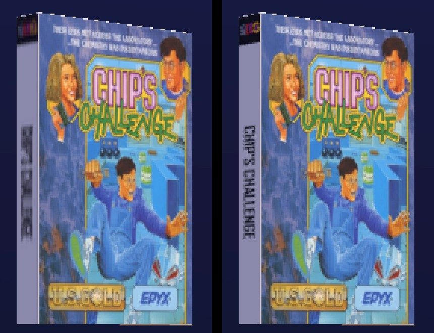

# 16× anisotropic filtering: checks and measurements

Measured on 1 October 2026 on the baseline Steam Deck (the machine in [m1-spike.md](m1-spike.md#machine)), docked, windowed at 1280×800.

- Builds are ExportRelease on .NET 8.0.31, Mobile/D3D12, with the shader baker on.
- **Before** is commit `44ce92c` (Godot's default anisotropy, 4×), exported to `artifacts/aniso-before/` before the change. **After** sets `rendering/textures/default_filters/anisotropic_filtering_level=4` (16×) in `project.godot`, exported to `artifacts/aniso-after/`. Both were benched in the same session, with nothing else running.
- Every scenario is one warm-up and 5 benched runs, and the tables give the medians. The JSON is in [anisotropy/](anisotropy/).
- The decision is in [ARCHITECTURE.md](../ARCHITECTURE.md) (decisions log, 2026-10-01).

```powershell
# For each build (-Executable artifacts\aniso-before\... or ...\aniso-after\...):
.\tools\bench-export.ps1 -Label <build>-scroll -AppArgs "--user-dir=$PWD\artifacts\synthetic", '--bench-scenario=scroll'
# B: the owner's library with ScreenScraper art (951 DOS games, 13,452 in all)
.\tools\bench-export.ps1 -SkipExport -Label <build>-dos -AppArgs "--user-dir=<library>", '--bench-scenario=scroll', '--bench-system=dos'
```

## Why

A DOS spine scraped from ScreenScraper is 60×680. Its derivative squeezes it into the 512² square, and the spine slot uses the 256² mip, so the layer is 256 texels across 60 pixels of art and 256 down 680. On screen the focused box's spine is about 32 pixels wide and 290 tall: 8 texels a pixel across and under 1 along, more when the box turns. The sampler already asked for anisotropic filtering, but at Godot's default of 4× the GPU still took the 128² mip, so the title was about 128 texels tall across 290 pixels and unreadable. At 16× it takes the 256² layer. Covers and backs, which are near square, were barely touched by it.



The captures were taken with each export at frame 150, with `--fixed-fps 60 --no-overlay`.

## Results

**A. The 60 s scroll of 10,000 PS2 games** (`artifacts/synthetic`, square synthetic covers on DVD cases).

| | Before (4×) | After (16×) |
|---|---|---|
| Start-up of our code | 532 ms | 577 ms |
| Scroll p50, p95, p99 | 16.83, 17.51, 18.05 ms | 16.84, 17.46, 18.14 ms |
| Hitches, frames over 2× | 2, 1 | 2, 1 |
| GPU, render CPU | 1.24, 0.27 ms | 1.26, 0.28 ms |
| Main-thread allocation in the scroll | 64 B | 64 B |
| Grid textured | 99.42% | 99.43% |
| Working set | 436 MB | 438 MB |

**B. The 60 s scroll of 951 DOS games with real art** (`big_box`, shaped by each game's art, with ScreenScraper's covers, backs and spines).

| | Before (4×) | After (16×) |
|---|---|---|
| Start-up of our code | 451 ms | 412 ms |
| Scroll p50, p95, p99 | 16.83, 17.47, 18.00 ms | 16.84, 17.46, 18.09 ms |
| Hitches, frames over 2× | 0, 0 | 0, 0 |
| GPU, render CPU | 1.41, 0.38 ms | 1.42, 0.37 ms |
| Main-thread allocation in the scroll | 64 B | 64 B |
| Grid textured | 100% | 100% |
| Working set | 424 MB | 425 MB |

**Every difference is within run-to-run noise.** GPU time moves by 0.01–0.02 ms, inside each build's own spread (1.23–1.26 ms before and 1.24–1.31 ms after in A; 1.40–1.44 and 1.39–1.44 ms in B). Frame-time percentiles move by under 0.1 ms. Hitches are at the environment's usual 0–4 a run (A3). Start-up moves both ways between the scenarios; it isn't touched by a sampler setting.

## What's left

The spine slot's layer keeps 256 of a DOS spine's 680 rows, so a tall focused box at 1080p and above is still a little soft. Doing better would mean deriving strip-shaped art differently.
